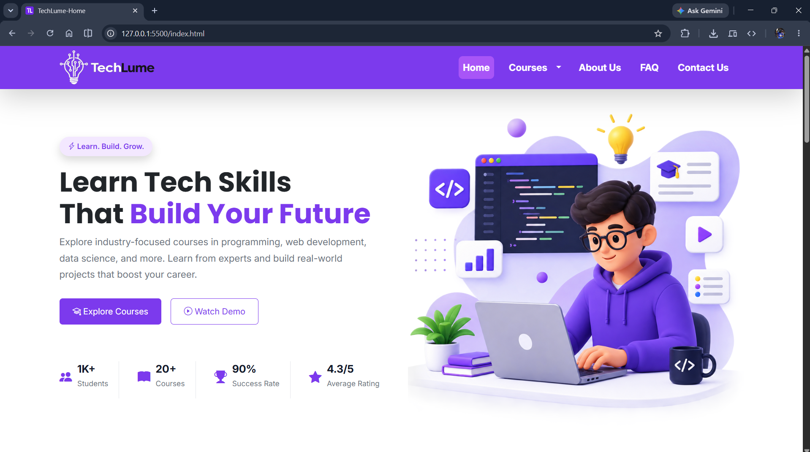
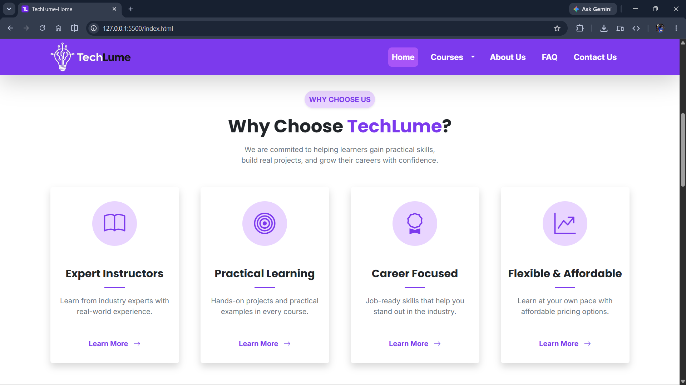
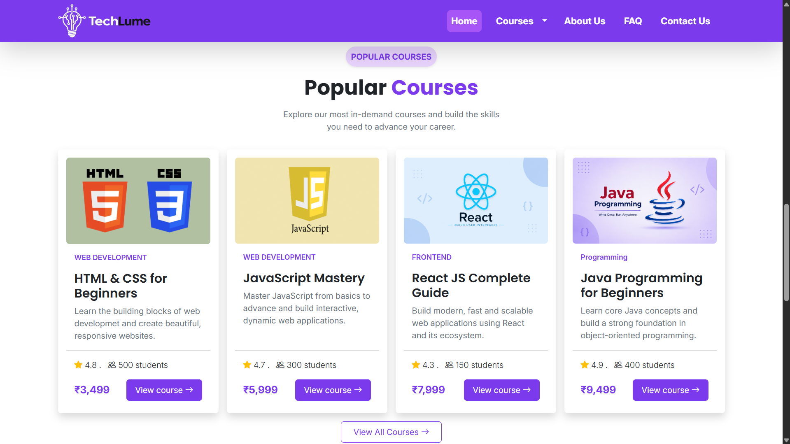
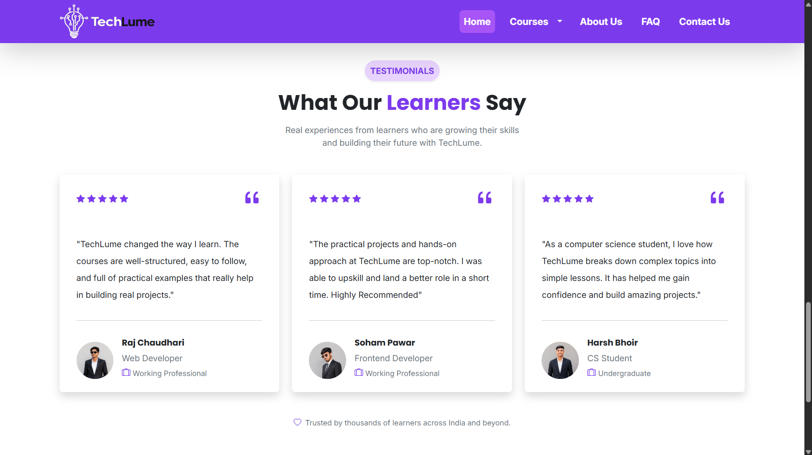
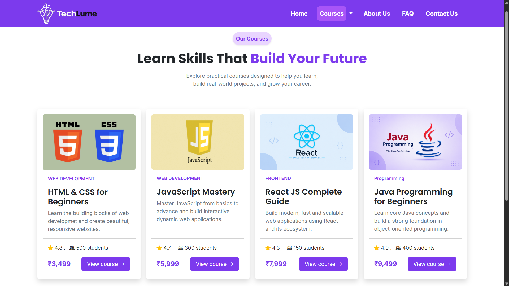
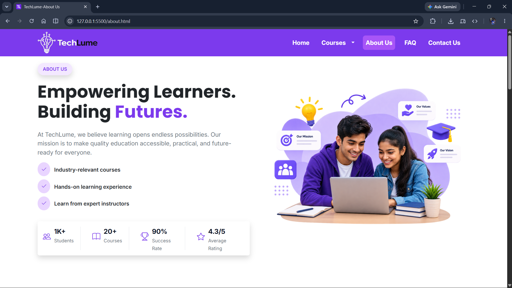
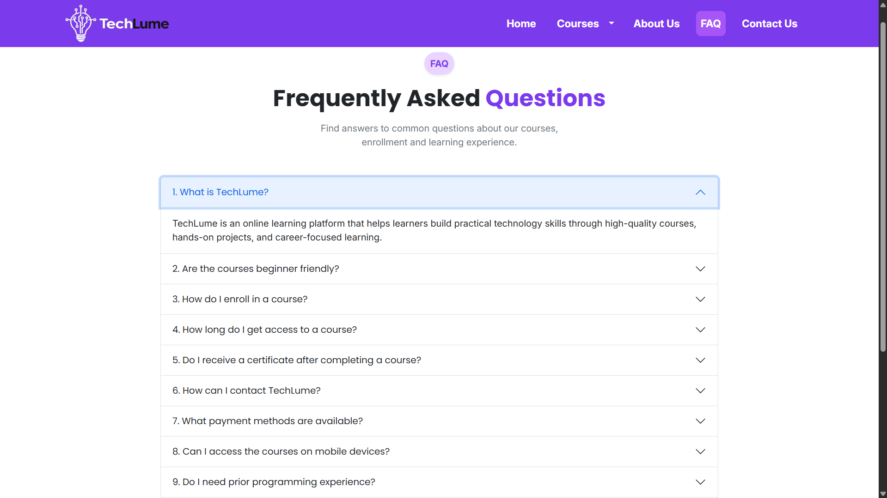
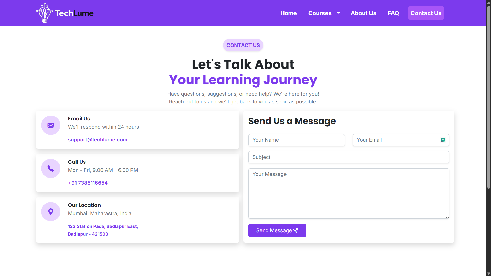
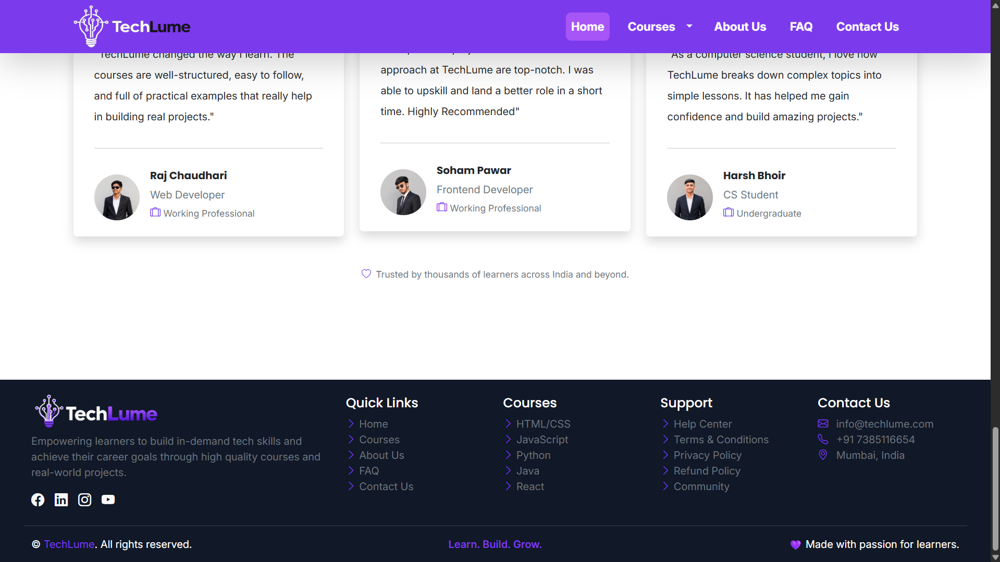

# TechLume

> A modern, responsive online learning platform website built as part of
> the Bootstrap module at IT Vedant.

## 📌 Project Overview

**TechLume** is a frontend educational website designed as an online
learning platform where users can explore courses, learn about
instructors, read learner testimonials, find answers to common
questions, and contact the platform.

The project was created primarily as a **learning and practical
implementation project for the Bootstrap 5 module at IT Vedant**. The
goal was to take the Bootstrap concepts learned during the module and
apply them to a complete multi-page website.

The project combines **Bootstrap 5 with custom CSS** to create a
professional, responsive, and consistent user interface.

## 🎯 Purpose of the Project

The main objectives of TechLume were to:

-   Practically apply Bootstrap 5 concepts.
-   Understand Bootstrap's responsive grid system.
-   Practice Bootstrap components and utility classes.
-   Combine Bootstrap with custom CSS.
-   Build a consistent design across multiple webpages.
-   Create a responsive and user-friendly educational website.
-   Improve frontend development and UI design skills.

## 🌐 Live Demo

Experience the live TechLume website:

👉 **[View TechLume Live Demo](https://bhushank45.github.io/TechLume/)**

TechLume is deployed using **GitHub Pages** and can be accessed directly in a web browser.

## ✨ Main Features

-   Responsive purple-themed navigation bar.
-   Hero section with call-to-action buttons.
-   Popular course cards.
-   Why Choose TechLume section.
-   Platform statistics.
-   Expert instructors section.
-   Testimonials section.
-   About and mission sections.
-   FAQ accordion.
-   Contact information and contact form.
-   Responsive layouts using Bootstrap.
-   Custom styling using CSS.
-   Bootstrap Icons.
-   Google Fonts using Poppins and Inter.
-   Reusable visual patterns across pages.

## 📄 Website Pages

| Page | Description |
|---|---|
| 🏠 **Home** | Hero, benefits, popular courses, instructors, testimonials, and other platform sections |
| 📚 **Courses** | Course cards with course information, ratings, students, pricing, and actions |
| ℹ️ **About Us** | Platform introduction, mission, vision, values, and learning approach |
| ❓ **FAQ** | Frequently asked questions using Bootstrap Accordion |
| 📩 **Contact Us** | Contact information and frontend contact form |

# 📸 Screenshots

## 🏠 Homepage

### Hero Section

The homepage introduces TechLume with the main value proposition, call-to-action buttons, navigation, and platform statistics.



### Why Choose TechLume

Highlights the key benefits of learning through the platform.



### Popular Courses

Displays popular courses using responsive Bootstrap cards.



### Expert Instructors

Shows the expert instructor section with instructor profiles and carousel controls.


### Testimonials

Displays learner feedback using testimonial cards.



---

## 📚 Courses Page

The Courses page displays available courses with course images, descriptions, ratings, student counts, pricing, and action buttons.



---

## ℹ️ About Us

The About Us page introduces TechLume and explains its purpose and learning approach.



### Our Mission

The mission section presents TechLume's mission, vision, and core values.


---

## ❓ FAQ

The FAQ page uses the Bootstrap Accordion component to organize frequently asked questions.



---

## 📩 Contact Us

The Contact Us page provides contact information and a frontend contact form.



---

## 🦶 Footer

The footer contains TechLume branding, quick links, course links, support links, social media icons, and contact information.



## 🛠️ Technologies Used

### HTML5

Used to create the structure and semantic content of the webpages.

### CSS3

Used for custom styling, colors, typography, spacing, hover effects,
cards, sections, and other visual customizations.

### Bootstrap 5

Used for:

-   Responsive grid system
-   Navbar
-   Cards
-   Buttons
-   Accordion
-   Forms
-   Spacing utilities
-   Flex utilities
-   Responsive classes
-   Other UI components

### Bootstrap Icons

Used for interface icons throughout the website.

### Google Fonts

The project uses:

-   **Poppins** for headings and prominent UI text.
-   **Inter** for body text and supporting content.

## 🎨 Design System

TechLume follows a purple-first educational platform design.

### Primary Colors

  Purpose          Color
  ---------------- -----------
  Primary Purple   `#7C3AED`
  Hover Purple     `#A855F7`
  Light Purple     `#E9D5FF`
  Heading Text     `#111827`
  Paragraph Text   `#6B7280`
  Border           `#E5E7EB`
  Footer           `#111827`
  White            `#FFFFFF`

### Typography

-   **Poppins**: headings, logo, section titles, card titles, buttons.
-   **Inter**: paragraphs, navigation, forms, lists, footer content, and
    supporting text.

## 📁 Project Structure

``` text
TechLume/
│
├── index.html
├── about.html
├── courses.html
├── faq.html
├── contact.html
├── PRD.md
├── README.md
├── .gitignore
│
└── assets/
    │
    ├── css/
    │   ├── style.css
    │   └── media.css
    │
    ├── js/
    │   └── script.js
    │
    └── images/
        ├── hero.png
        ├── about.png
        ├── TechLume_logo.png
        ├── footer_logo.png
        ├── TL_icon.png
        │
        ├── Courses/
        ├── Instructors/
        ├── Testimonials/
        └── favicon_io/
```

## 🖥️ Website Sections

### Homepage

The homepage includes:

-   Navigation bar
-   Hero section
-   Features / benefits
-   Popular courses
-   Why Choose TechLume
-   Statistics
-   Expert instructors
-   Testimonials
-   Footer

### Courses

The Courses page presents available learning courses in a card-based
layout.

### About

The About page explains the purpose of TechLume, its mission, and its
learning approach.

### FAQ

The FAQ page uses the **Bootstrap Accordion** component to organize
frequently asked questions.

### Contact

The Contact page provides contact information and a frontend contact
form.

## 📱 Responsive Design

Responsive design was an important part of the project.

Bootstrap's responsive grid system and utility classes were used to help
the website adapt to different screen sizes.

Custom CSS was added where Bootstrap's default styling was not
sufficient for the required design.

## 🚀 How to Run the Project

TechLume is a static frontend project, so no backend server or database
is required to view the website.

### Option 1: Open Directly

1.  Download or clone the project.
2.  Open the project folder.
3.  Open `index.html` in a web browser.

### Option 2: VS Code Live Server

1.  Open the project folder in Visual Studio Code.
2.  Install the **Live Server** extension if it is not already
    installed.
3.  Right-click `index.html`.
4.  Select **Open with Live Server**.

## 📚 Learning Journey

TechLume is part of the frontend learning journey at **IT Vedant**.

### HTML + CSS + JavaScript Module

After learning HTML, CSS, and JavaScript, the project **ReuseMyBook**
was created to practically apply those concepts.

The ReuseMyBook project included:

-   Project presentation
-   Mock
-   Project showcase

The project received **4.5/5**, and the mock also received **4.5/5**.

### Bootstrap Module

After completing the HTML, CSS, and JavaScript module, the Bootstrap
module was completed by creating **TechLume**.

The primary purpose of TechLume was to **test and practically apply
Bootstrap knowledge** by building a complete multi-page website using
Bootstrap together with custom CSS.

### React Module

React is the next stage of the learning journey, with a separate project
planned for practical implementation.

## 💡 What I Learned

Through this project, I practiced:

-   Bootstrap 5 grid system.
-   Responsive web design.
-   Bootstrap components.
-   Bootstrap utility classes.
-   Navbar implementation.
-   Card layouts.
-   Accordion components.
-   Form styling.
-   Bootstrap Icons.
-   Combining Bootstrap with custom CSS.
-   Consistent UI design across multiple pages.
-   Organizing a multi-page frontend project.

## 🔮 Future Improvements

TechLume is currently a frontend learning project. It can be extended
into a fully functional learning platform by adding:

-   User registration and login.
-   Backend integration.
-   Database connectivity.
-   Course enrollment.
-   Student dashboard.
-   Course search and filtering.
-   Course detail pages.
-   Payment integration.
-   Admin dashboard.
-   Dynamic course management.
-   Real contact form submission.
-   Student progress tracking.

## ⚠️ Current Scope

This project is primarily a **frontend and Bootstrap learning project**.

The current contact form and other interactive elements that require
server-side processing are not connected to a backend or database.

## 👨‍💻 Author

**Bhushan Khade**

B.Sc. Computer Science graduate\
Full Stack Java Development learner at IT Vedant

## 📌 Project Status

**Completed**

TechLume was completed as the practical project for the Bootstrap module
at IT Vedant.

------------------------------------------------------------------------

### TechLume

**Technology + Lume (light/illumination)**

The name represents the idea of **illuminating the path of learning
through technology**.
